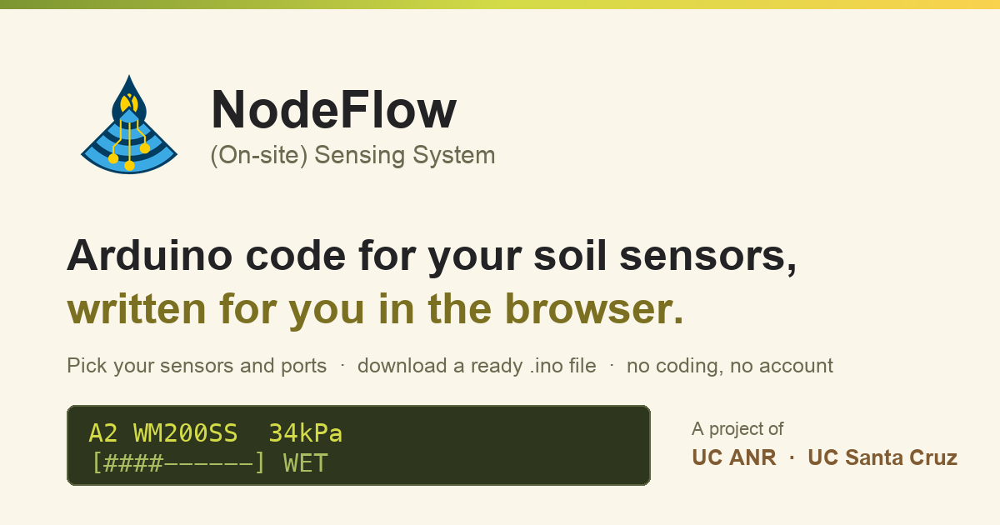

<p align="center">
  
</p>

<h1 align="center">NodeFlow (On-site) Sensing System</h1>

<p align="center">
  A web page that writes the Arduino code for your soil sensors, so you do not have to.
  <br>
  <a href="https://fernlag.github.io/NodeFlow-Onsite-Sensing-System/"><strong>Open the code generator</strong></a>
</p>

---

Say which sensors you have, which port each one is plugged into, and what you
want to see on the screen. The page builds a complete `.ino` sketch in your
browser and downloads it. Open that file in the Arduino IDE, press upload, and
your readings appear on the display.

There is no account, no cost, and no programming. The whole thing runs in the
browser: your configuration is turned into code on your own machine, not on a
server. Once the page has loaded a single time, it keeps working with no
internet connection.

This is part of a research and outreach project at UC Agriculture and Natural
Resources and UC Santa Cruz. We build do-it-yourself, low cost, open source
tools that help growers manage water at farm scale.

## What it supports

The sketch targets an **Arduino Uno R3** with a **16x2 LCD keypad shield**. The
shield's buttons sit on a resistor ladder on A0, so A0 is reserved and your
sensors go on A1 to A5.

| Sensor | What you can read from it |
| --- | --- |
| Irrometer Watermark 200SS, through a 200SS-VA3 adapter | Soil water tension in kPa, a wet to dry percentage, or three management states based on your soil texture |
| Irrometer 200TS soil temperature | Temperature, on its own or paired with a Watermark on the same adapter |
| DFRobot capacitive probe, wired to an analog pin | Raw counts, or a percentage once you have given it an air reading and a water reading |

The VA-3 adapter carries up to three Watermarks plus one shared temperature
probe. It outputs 0 to 2.8 V and refreshes each channel every five minutes,
holding the previous value in between, so give it time after powering up.
Tension is `kPa = Volts / 0.01176` and temperature is
`degF = 48.48 * (V - 0.49) + 20`. The adapter never reports resistance.

Measurements you can put on the screen: raw value in ADC counts, raw value as a
percentage, management thresholds, tension in kPa, temperature, wetting front,
and vertical flow rate. One rule holds throughout: a higher percentage always
means wetter soil. The only exception is the raw reading, which reports
whatever the sensor put on the pin.

## What the display shows

```
A2 WM200SS  34kPa
[####------] WET
```

The top line is the port, a short sensor name and the value. The bottom line is
the bar, state or warning you chose. The left and right buttons step through
your sensors. The backlight goes out after five minutes without a button press
and any button wakes it.

The sketch also warns when the battery is running down, using the chip's
internal 1.1 V reference. That reading only means something on battery power
through the barrel jack, not on USB.

## Getting started

1. Open the [code generator](https://fernlag.github.io/NodeFlow-Onsite-Sensing-System/).
2. Add one block per sensor: the sensor, the port, the measurement, the display.
3. Fill in the calibration values for your field. The defaults are a starting
   point, not a measurement of your soil.
4. Press generate and download the `.ino` file.
5. Follow [what to do after you download](https://fernlag.github.io/NodeFlow-Onsite-Sensing-System/thank-you.html)
   to get it onto the board.

## Repository layout

```
index.html              the generator
thank-you.html          what to do after the download
privacy.html            privacy policy
terms.html              terms of use
404.html                custom not-found page
sw.js                   service worker, must stay at the root
site.webmanifest        installable-app metadata
robots.txt sitemap.xml  crawler rules and page list
favicon.ico

assets/
  css/styles.css        the whole stylesheet
  js/config.js          endpoint, limits and contact details, all public
  js/main.js            generated config at the top, the generator below it
  js/site.js            footer, consent banner, service worker registration
  img/                  logos, favicons, share image
  docs/consent.pdf      research consent form

data/                   sensor_configuration.xlsx, the source of truth
tools/
  build.py              spreadsheet into the main.js config blocks
  watch.py              reruns build.py when the spreadsheet is saved
  verify_sketches.py    compiles every sketch the form can produce
  generate_all_sketches.js  builds those sketches for the check above
  arduino_stub.h        stands in for the Arduino headers when checking
  templates/            per-sensor stubs written by build.py
server/apps-script/     the submission endpoint, to paste into Apps Script
docs/                   security notes and the deployment checklist
```

## For developers

Three pieces do the work.

**`data/sensor_configuration.xlsx`** defines the sensors, the measurements each
one offers, the parameters each measurement needs, the tooltips, and the
display options allowed for each. It spans the sheets `sensors`, `params`,
`viz_options`, `ports` and `survey_questions`.

**`tools/build.py`** reads that spreadsheet with `openpyxl` and rewrites only
the configuration blocks at the top of `assets/js/main.js`: `SENSOR_TYPES`,
`OUTPUT_PARAMS`, `OUTPUT_VIZ`, `VIZ_OPTIONS`, `PORTS`, `PORT_TIPS` and
`SURVEY_QUESTIONS`.

**`assets/js/main.js`** has two halves. The generated configuration at the top,
and hand written code below it: the Arduino code templates and the generator
that assembles them. `build.py` never touches the hand written half.

### Changing what the form offers

```sh
pip install openpyxl
python3 tools/build.py        # rebuild after editing the spreadsheet
python3 tools/watch.py        # or rebuild on every save, Ctrl+C to stop
```

If you add a new measurement in the spreadsheet, add a matching entry to
`TEMPLATES.outputs` in `assets/js/main.js` by hand. The same goes for new
sensor types (`TEMPLATES.sensors`) and new display options (`TEMPLATES.viz`).
`build.py` writes configuration, never Arduino logic.

### Running it locally

Service workers need a real origin, so serve the folder rather than opening the
file directly:

```sh
python3 -m http.server 8000
```

Then visit `http://localhost:8000`. The page notices localhost and unregisters
the service worker, so you never get served a stale cache while working.

### Checking the generated sketches

`tools/verify_sketches.py` builds a sketch for every combination the form can
offer, currently 268 of them, and puts each one through a real C++ compiler
against the Arduino stub in `tools/arduino_stub.h`. It catches values a
template asked for that no parameter supplies, unbalanced braces, undeclared
variables and wrong argument types, all before anyone uploads a file.

It also reports configuration gaps that compile perfectly well and still reach
a grower as software that does nothing: a measurement whose only display option
is "No visualization", or a display option the sensors sheet allows but
`viz_options` has switched off.

```sh
python3 tools/verify_sketches.py           # needs Node and g++ or clang++
python3 tools/verify_sketches.py --keep    # leave the sketches on disk to read
```

Run it after any change to the templates in `assets/js/main.js` or to the
spreadsheet.

### Deploying

1. Edit the spreadsheet.
2. `python3 tools/build.py`
3. `python3 tools/verify_sketches.py`
4. **Bump `CACHE_NAME` in `sw.js`.** Skip this and everyone who has visited
   before keeps the old page out of their cache, indefinitely.
5. Commit and push. GitHub Pages publishes from the repository root.

The longer checklist, including the values to replace before a first public
deploy, is in [`docs/DEPLOYMENT.md`](docs/DEPLOYMENT.md). Security notes and the
findings from the last review are in [`docs/SECURITY.md`](docs/SECURITY.md).
What every measurement actually computes, where each constant comes from, and
where the spreadsheet and the code disagree, is in
[`docs/EQUATIONS.md`](docs/EQUATIONS.md).

### Languages

The generator reads in English and Spanish, switched with the button at the top
right and remembered per browser. Translations live in `assets/js/i18n.js`;
spreadsheet text is keyed on the sensor, measurement or viz identifier rather
than on the English wording. The Spanish has not been reviewed by a native
speaker yet. The static pages and the text the sketch puts on the LCD are still
English only.

## Privacy

Nothing is sent while you fill in the form. When you confirm a download, and
only then, the details you typed are recorded for the research project, after
you have read the consent form. There are no advertising cookies and no third
party trackers. The full policy is on the
[privacy page](https://fernlag.github.io/NodeFlow-Onsite-Sensing-System/privacy.html).

## Built with

Python, JavaScript, HTML and CSS. No frameworks, no build step for the site
itself, and nothing loaded from another server.
